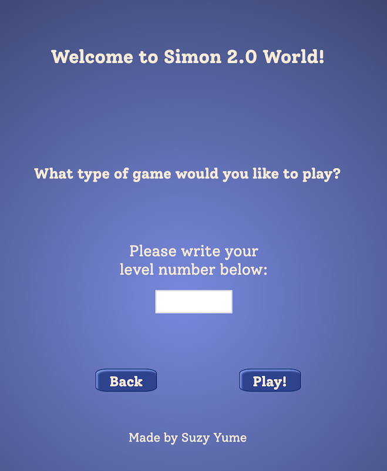
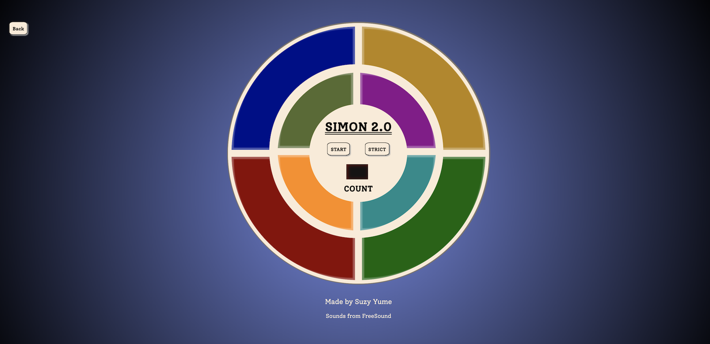

# Welcome to Simon 2.0 World!

---

### Simon History

Also known for creating the first video game system, inventor **Ralph Baer** and his coworker **Howard Morrison** developed the Simon game inspired by an Atari arcade game called _Touch Me_.

Named after the children's game of _Simon Says_, the game was released by **Milton Bradley Company** in 1978 with a midnight release party at Studio 54, the elite disco in NYC at the time.

[Reference](https://americanhistory.si.edu/collections/search/object/nmah_1302005)

---

### Some Screenshots

---

### Technologies Used

-   Hypertext Markup Language 5 (HTML)
-   Cascading Style Sheets 3 (CSS)
-   JavaScript (JS)

---

### Play

You can play Simon 2.0 World here: <https://suzynakayama.github.io/simon/>

You can also play on your phone! 

How to play:

-   First choose if you want it to be endless or leveled
    -   If you want leveled, write how many levels do you want
-   Press play!
-   Press the start button
    -   If you want to play on strict mode, click on strict mode button
        -   Strict Mode: if you press the wrong order, you will start from the beginning
-   Copy the computer order
-   Enjoy! :wink:

---

### Next Steps

Implement a two-player game, with two simons side by side and each person plays in one of them.
